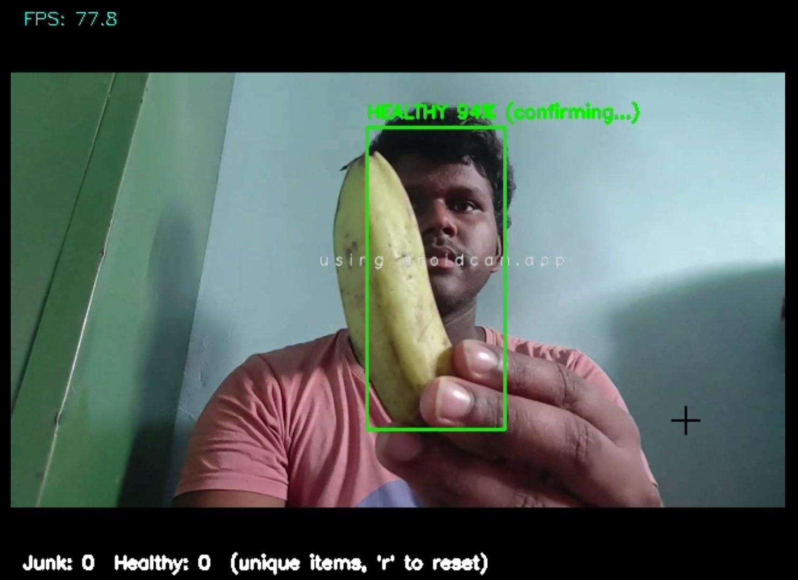
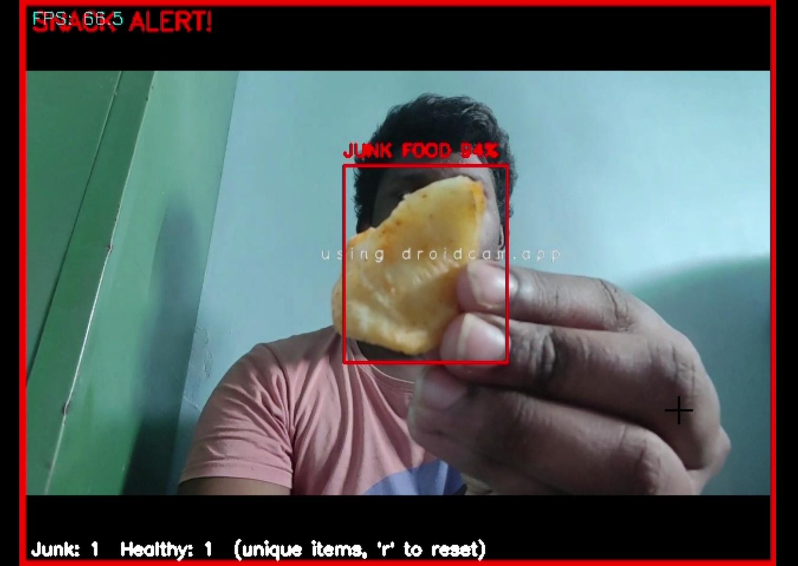

# 🍎 Snack Patrol

### Real-Time Food Detection and Snack Alert System using TensorFlow + SSD MobileNet + OpenCV

Snack Patrol is a real-time webcam-based object detection project built to apply concepts learned while studying TensorFlow and deep learning.

The project uses a pre-trained **SSD MobileNet v1 COCO** object detection model to detect selected food and drink objects from a webcam feed.

The detected objects are grouped into:

- 🥦 HEALTHY
- 🍕 JUNK FOOD
- 🥤 DRINK

This project is specifically made for low end pc owners like me!!!

The project also includes object tracking, confidence filtering, small-object re-verification, duplicate-count prevention, snapshot logging, and a real-time snack alert.

---
## 📸 Demo

### Healthy Food Detection



### Junk Food Alert



# 📌 Project Motivation

I created Snack Patrol after completing my TensorFlow beginner-level learning.

Instead of stopping with a certificate, I wanted to build a small practical application that combines:

- TensorFlow
- Deep learning
- Object detection
- Computer vision
- Python
- Real-time webcam processing

The project helped me understand how a pre-trained deep learning model can be combined with normal Python logic to create a practical application.

---

# ✨ Features

### 💻 Optimized for Low-End Devices

Snack Patrol is specifically tuned to run on low-end PCs, including systems without a dedicated graphics card. The project uses CPU-friendly settings such as controlled frame processing, confidence thresholds, and lightweight SSD MobileNet inference to provide practical real-time object detection on limited hardware.

## 🔍 Real-Time Object Detection

The program continuously reads frames from a webcam and sends selected frames to the TensorFlow object detection model.

## 🥗 Food Categorization

Detected COCO classes are grouped using custom rules into:

- HEALTHY
- JUNK FOOD
- DRINK

## 🎯 Confidence Filtering

Low-confidence detections are ignored to reduce unreliable predictions.

## 🔄 Object Tracking

A lightweight IoU-based tracker attempts to identify the same object across multiple processed frames.

This helps prevent one physical object from being counted repeatedly.

## 🧠 Class Voting

When the model changes its prediction between frames, the tracker stores class votes and uses the most common class.

This helps reduce label flickering.

## 🔎 Small-Object Re-verification

Small or medium-confidence detections can be cropped, enlarged, and passed through the model again for a second verification.

## 🚨 Snack Alert

When currently tracked junk food is detected, the program displays:

`SNACK ALERT!`

with a red border around the webcam window.

## 📸 Snapshot Logging

Confirmed tracked objects can be saved automatically as timestamped images.

## 🔢 Unique Item Counting

An object is counted only after being confirmed by multiple processed frames.

## 🔄 Score Reset

Press:

`R`

to reset the Healthy and Junk Food scores.

## ❌ Exit

Press:

`Q`

to stop the program.
 
 🧰 Technologies Used
Python 3.6
TensorFlow 1.5.0
OpenCV 4.5.3
NumPy 1.19.5
protobuf 3.19.6
six 1.16.0
TensorFlow Object Detection API v1.12.0
SSD MobileNet v1
COCO Dataset
⚠️ Important: This Project Uses Legacy TensorFlow

!!!!I give how to download it in the below installation session, see it!!!!

This project uses:

Python 3.6
TensorFlow 1.5.0
TensorFlow Object Detection API v1.12.0

These are old versions.

Do not simply install the latest TensorFlow version and expect this project to work.

The code uses TensorFlow 1.x APIs such as:

tf.Graph()
tf.Session()
tf.GraphDef()
tf.gfile.GFile()

Therefore, the versions listed above should be followed carefully.

💻 Tested Hardware

The project was developed and tested on CPU-only hardware.

Example test setup:

CPU: Intel Core i3
GPU: No dedicated NVIDIA GPU
Python: 3.6
TensorFlow: 1.5.0

The code is therefore configured for CPU execution.

📁 Project Structure

After downloading the GitHub repository, the project should look like:

SnackPatrol/
│
├── snack_patrol.py
├── requirements.txt
├── README.md
├── .gitignore
│
├── pretrained_models/
│
├── snack_log/
│
└── screenshots/
snack_patrol.py

Main application.

requirements.txt

Contains the tested Python package versions.

pretrained_models/

The SSD MobileNet model is downloaded here automatically.

You do NOT need to upload the model to GitHub.

snack_log/

Contains snapshots generated while the program is running.

This folder is generated automatically and is intentionally not included in the repository.

screenshots/

Optional screenshots for the project documentation/demo.

🛠️ Installation
Step 1 — Install Anaconda

Install Anaconda if it is not already installed.

Make sure Anaconda Prompt is available.

Step 2 — Create the Conda Environment

Because this project uses TensorFlow 1.5, use a Python 3.6 environment.

Open Anaconda Prompt and run:

conda create -n tf15 python=3.6

Activate it:

conda activate tf15

You should now see:

(tf15)

at the beginning of your command prompt.

Example:

(tf15) C:\Users\YourName>
Step 3 — Install the Required Python Packages

Install the versions tested with this project:

pip install tensorflow==1.5.0
pip install opencv-python==4.5.3.56
pip install numpy==1.19.5
pip install six==1.16.0
pip install protobuf==3.19.6

Or install everything using:

pip install -r requirements.txt
Step 4 — Verify TensorFlow

Run:

python -c "import tensorflow as tf; print(tf.__version__)"

Expected:

1.5.0

If another TensorFlow version is printed, you are probably not using the correct environment.

Check:

where python

The first result should point to the tf15 environment.

Example:

C:\Users\YourName\Anaconda3\envs\tf15\python.exe
Step 5 — Verify OpenCV

Run:

python -c "import cv2; print(cv2.__version__)"

Expected:

4.5.3
Step 6 — Set Up the TensorFlow Object Detection API

This project uses the TensorFlow Object Detection API from the TensorFlow Models repository.

A compatible TF1-era release is required.

The tested setup uses:

TensorFlow Models v1.12.0

Download the repository release from:

https://github.com/tensorflow/models/tree/v1.12.0

Download the ZIP archive using:

Code → Download ZIP

Extract it somewhere convenient.

For example:

C:\Users\YourName\TensorFlow\models-1.12.0

The important folder is:

models-1.12.0\research\object_detection
Step 7 — Compile the Object Detection .proto Files

The Object Detection API contains .proto files that must be compiled into Python files.

You need the Protocol Buffers compiler:

protoc

A TF1-compatible setup can use:

protoc 3.5.1

Download:

https://github.com/protocolbuffers/protobuf/releases/tag/v3.5.1

Look under Assets for:

protoc-3.5.1-win32.zip

Extract it.

For example:

C:\Users\YourName\protoc

You should have:

C:\Users\YourName\protoc\bin\protoc.exe

Verify it:

C:\Users\YourName\protoc\bin\protoc.exe --version

Expected:

libprotoc 3.5.1
Step 8 — Compile the .proto Files on Windows

Open Anaconda Prompt.

Activate the environment:

conda activate tf15

Go to the Object Detection API research directory:

cd C:\Users\YourName\TensorFlow\models-1.12.0\research

Compile the .proto files:

for %f in (object_detection\protos\*.proto) do C:\Users\YourName\protoc\bin\protoc.exe "%f" --python_out=.

After compilation, files ending in:

_pb2.py

should appear inside:

object_detection\protos
Step 9 — Test the Object Detection API

In the same activated environment, run:

python -c "import sys; sys.path.insert(0, r'C:\Users\YourName\TensorFlow\models-1.12.0\research'); from object_detection.utils import label_map_util; print('Object Detection API found')"

Expected:

Object Detection API found

TensorFlow 1.5 may also display old NumPy FutureWarning messages.

Those warnings are not necessarily errors.

The important result is:

Object Detection API found
📍 Step 10 — Configure the Object Detection API Path

Open:

snack_patrol.py

Find:

OD_API_PATH = r"C:\Users\intel\TensorFlow\models-1.12.0\research"

Change it to the location where YOU extracted the Object Detection API.

For example:

OD_API_PATH = r"C:\Users\YourName\TensorFlow\models-1.12.0\research"

This is the main path that may need to be changed on another computer.

The project uses this path to locate the Object Detection API and the COCO label map.

📷 Camera Setup
Option 1 — Laptop Webcam

If your default webcam is available, try:

CAM_INDEX = 0
Option 2 — DroidCam / Phone Camera

If you use DroidCam and Windows recognizes the phone as a camera, change:

CAM_INDEX = 1

The camera number is different on different computers.

To test available cameras:

import cv2

for i in range(5):
    cap = cv2.VideoCapture(i)

    if cap.isOpened():
        ret, frame = cap.read()

        if ret:
            print("Camera available:", i)

    cap.release()

If your phone is camera 1, use:

CAM_INDEX = 1

📱 DroidCam Notes

If using DroidCam:

Install DroidCam on the phone.
Install the DroidCam client on Windows.
Connect the phone.
Start the camera.
Test which camera index OpenCV detects.
Set that number in:
CAM_INDEX = 1

Before running the complete project, test the camera separately:

import cv2

cap = cv2.VideoCapture(1)

cap.set(cv2.CAP_PROP_FRAME_WIDTH, 640)
cap.set(cv2.CAP_PROP_FRAME_HEIGHT, 480)

while True:
    ret, frame = cap.read()

    if not ret:
        print("Could not read frame")
        break

    cv2.imshow("Camera Test", frame)

    if cv2.waitKey(1) & 0xFF == ord("q"):
        break

cap.release()
cv2.destroyAllWindows()

The camera should display normally before running Snack Patrol.

⚙️ Performance Settings

The project is configured to be reasonably lightweight for CPU-only systems.

Current recommended values:

CAPTURE_W = 640
CAPTURE_H = 480

PROCESS_EVERY_N = 2

CPU_THREADS = 4
If the program is slow

First try:

CAPTURE_W = 480
CAPTURE_H = 360

If it is still slow, increase:

PROCESS_EVERY_N = 3

This means detection is performed every third frame instead of every second frame.

🎯 Detection Settings

The main detection settings are:

LOW_THRESH = 0.30
CONFIRM_THRESH = 0.50
SMALL_AREA_FRAC = 0.05

IOU_MATCH_THRESH = 0.30
MIN_HITS_TO_CONFIRM = 3
MAX_MISSES = 5

These control:

confidence filtering
object confirmation
small-object verification
object tracking
lost-object handling

Users can adjust these values depending on lighting, camera quality, and performance.

▶️ Running the Project

Open Anaconda Prompt.

Activate the environment:

conda activate tf15

Go to the project folder:

cd path\to\SnackPatrol

Example:

cd C:\Users\YourName\SnackPatrol

Run:

python snack_patrol.py

🤖 First Run

On the first run, the program checks whether the SSD MobileNet model is available.

If it is not available, the program automatically downloads:

ssd_mobilenet_v1_coco_2017_11_17.tar.gz

and extracts it into:

pretrained_models/

You therefore do NOT need to manually upload the large pre-trained model to GitHub.

📊 What the Program Detects

The project uses COCO classes and currently watches selected IDs.

Healthy
banana
apple
orange
broccoli
carrot
Junk Food
hot dog
pizza
donut
cake
Drink
bottle
wine glass
cup

These groups are project-defined rules.

They are NOT classifications learned by the neural network.

⚠️ Important Limitations
1. Limited Food Categories

The model was trained on COCO.

It cannot reliably detect every type of food.

For example, many Indian foods may not be recognized.

Examples:

samosa
dosa
idli
vada
biryani
parotta

may not be available as direct COCO classes.

2. Healthy/Junk Classification Is Rule-Based

The model detects an object.

The Python program then decides its category using predefined IDs.

Therefore:

pizza → JUNK FOOD
banana → HEALTHY

comes from project rules.

It does not mean the model understands nutrition.

3. No Nutritional Analysis

The project does not calculate:

calories
protein
fat
sugar
carbohydrates
serving size

It is an object detection and categorization project, not a medical or nutritional system.

4. CPU Performance

The project was designed with CPU-only operation in mind.

Older SSD MobileNet models are lightweight compared with larger detectors, but real-time performance is still limited by CPU speed.

5. Detection Can Be Wrong

Object detection may fail or become less accurate with:

poor lighting
unusual angles
partially hidden objects
very small objects
cluttered backgrounds
low-quality camera input

The tracking and re-verification systems reduce some problems but cannot eliminate them completely.

🎮 Controls

While the program is running:

Q → Quit
R → Reset Healthy/Junk scores

📸 Output

Snapshots are automatically stored in:

snack_log/

Example:

20260906_203015_track1_JUNKFOOD.jpg

The snapshot filename contains:

timestamp
tracking ID
detected category

🔐 Privacy Note

The program uses camera frames locally for object detection.

Saved snapshots remain on the local machine unless the user manually shares them.

🚀 Future Improvements

Possible future versions could include:

Custom-trained food detector
Indian food detection
Samosa/Dosa/Idli/Biryani detection
Nutrition database
Calorie estimation
Better object tracking
Food portion estimation
Mobile application
Web dashboard
Personalized diet recommendations

🎓 Learning Outcome

This project helped me apply concepts related to:

TensorFlow
Deep learning
CNN-based object detection
Pre-trained models
Computer vision
OpenCV
TensorFlow sessions and graphs
Model inference
Bounding boxes
Confidence scores
Object tracking
Python automation
👨‍💻 Author

Karthikeyan S

AI & Data Science Student

This project was created as a practical learning project after completing TensorFlow beginner-level training.

# 📦 Installation

> ⚠️ **Important:** Snack Patrol uses a legacy TensorFlow 1.x environment.
> Follow the versions below carefully. Installing the latest TensorFlow/Python
> versions may make this project incompatible.

## 1. Install Anaconda

Download and install Anaconda:

https://www.anaconda.com/download

After installation, open:

**Anaconda Prompt**

---

## 2. Create the Python 3.6 Environment

Create the environment:

```bash
conda create -n tf15 python=3.6

Activate it:

conda activate tf15

You should see:

(tf15)

at the beginning of the command prompt.

Example:

(tf15) C:\Users\YourName>
3. Install the Tested Python Packages

Install the exact versions used while developing and testing Snack Patrol:

pip install tensorflow==1.5.0
pip install opencv-python==4.5.3.56
pip install numpy==1.19.5
pip install six==1.16.0
pip install protobuf==3.19.6

Or install them using:

pip install -r requirements.txt
Verify the installations

Check Python:

python --version

Expected:

Python 3.6.x

Check TensorFlow:

python -c "import tensorflow as tf; print(tf.__version__)"

Expected:

1.5.0

Check OpenCV:

python -c "import cv2; print(cv2.__version__)"

Expected:

4.5.3

Check NumPy:

python -c "import numpy; print(numpy.__version__)"

Expected:

1.19.5

Check protobuf:

python -c "import google.protobuf; print(google.protobuf.__version__)"

Expected:

3.19.6
🤖 TensorFlow Object Detection API Setup

Snack Patrol uses the TensorFlow 1.x Object Detection API.

The project was tested with:

TensorFlow Models v1.12.0
4. Download TensorFlow Models v1.12.0

Download the exact release:

https://github.com/tensorflow/models/archive/refs/tags/v1.12.0.zip

Extract the ZIP somewhere convenient.

For example:

C:\Users\YourName\TensorFlow\models-1.12.0

After extraction, make sure this folder exists:

C:\Users\YourName\TensorFlow\models-1.12.0\research\object_detection

You should see folders such as:

object_detection
slim

inside research.

⚠️ Do not download the latest TensorFlow Models repository for this project.
This project uses the older TF1-era Object Detection API.

🧩 Protocol Buffers Compiler (protoc)

The Object Detection API contains .proto files that must be compiled before Python can import the API correctly.

5. Download protoc 3.5.1

Download this exact file:

https://github.com/protocolbuffers/protobuf/releases/download/v3.5.1/protoc-3.5.1-win32.zip

Extract it somewhere convenient.

For example:

C:\Users\YourName\protoc

Make sure this file exists:

C:\Users\YourName\protoc\bin\protoc.exe

Verify the installation:

C:\Users\YourName\protoc\bin\protoc.exe --version

Expected:

libprotoc 3.5.1
6. Compile the Object Detection API Proto Files

Activate the environment first:

conda activate tf15

Go to the research directory:

cd C:\Users\YourName\TensorFlow\models-1.12.0\research

Compile all Object Detection .proto files:

for %f in (object_detection\protos\*.proto) do C:\Users\YourName\protoc\bin\protoc.exe "%f" --python_out=.

After successful compilation, files ending in _pb2.py should appear inside:

object_detection\protos

For example:

anchor_generator_pb2.py
box_coder_pb2.py
image_resizer_pb2.py
model_pb2.py
string_int_label_map_pb2.py
7. Configure the Object Detection API Path

Open:

snack_patrol.py

Find:

OD_API_PATH = r"C:\path\to\models-1.12.0\research"

Change it to the location where you extracted the TensorFlow Models repository.

For example:

OD_API_PATH = r"C:\Users\YourName\TensorFlow\models-1.12.0\research"

⚠️ Replace YourName with your Windows username.
Do not copy the exact path from this example unless it matches your computer.

The program also uses this path to locate:

object_detection\data\mscoco_label_map.pbtxt
8. Verify the Object Detection API

Run:

python -c "import sys; sys.path.insert(0, r'C:\Users\YourName\TensorFlow\models-1.12.0\research'); from object_detection.utils import label_map_util; print('Object Detection API found')"

Expected result:

Object Detection API found

You may see old TensorFlow/NumPy FutureWarning messages.

Those warnings can be ignored if the final line is:

Object Detection API found
📦 Pre-trained Model

You do not need to manually download the SSD MobileNet model.

When Snack Patrol starts, it checks whether the model exists.

If it is missing, the program automatically downloads:

ssd_mobilenet_v1_coco_2017_11_17.tar.gz

and extracts it into:

pretrained_models/

The expected structure is:

pretrained_models/
└── ssd_mobilenet_v1_coco_2017_11_17/
    └── frozen_inference_graph.pb

The large model files are intentionally not stored in the GitHub repository.

📷 Camera Setup

Snack Patrol can use a normal webcam or a virtual webcam such as DroidCam.

Open:

snack_patrol.py

Find:

CAM_INDEX = 1

Change the number according to your camera.

Typical examples:

0 → default laptop webcam
1 → second camera / DroidCam
2 → another connected camera

To test camera indexes:

import cv2

for i in range(5):
    cap = cv2.VideoCapture(i)

    if cap.isOpened():
        ret, frame = cap.read()

        if ret:
            print("Camera available:", i)

    cap.release()

If your phone camera appears as camera 1, use:

CAM_INDEX = 1
📱 DroidCam

If you want to use an Android phone as the camera:

Install DroidCam on the phone.
Install the DroidCam client on Windows.
Connect the phone and start the camera.
Find the camera index recognized by OpenCV.
Set CAM_INDEX in snack_patrol.py.

Before running Snack Patrol, test the camera independently.

Example:

import cv2

cap = cv2.VideoCapture(1)

cap.set(cv2.CAP_PROP_FRAME_WIDTH, 640)
cap.set(cv2.CAP_PROP_FRAME_HEIGHT, 480)

while True:
    ret, frame = cap.read()

    if not ret:
        print("Could not read frame")
        break

    cv2.imshow("Camera Test", frame)

    if cv2.waitKey(1) & 0xFF == ord("q"):
        break

cap.release()
cv2.destroyAllWindows()

Make sure the camera works normally before running the complete application.

▶️ Run Snack Patrol

Open Anaconda Prompt:

conda activate tf15

Go to the project folder:

cd C:\path\to\SnackPatrol

Run:

python snack_patrol.py
❗ Common Problems
ModuleNotFoundError: No module named 'tensorflow'

Make sure the correct Conda environment is active:

conda activate tf15

Then check:

where python

The first Python path should point to your tf15 environment.

ModuleNotFoundError: No module named 'object_detection'

Check:

TensorFlow Models v1.12.0 was downloaded.
The research\object_detection folder exists.
The .proto files were compiled.
OD_API_PATH points to the research folder.

Test with:

python -c "import sys; sys.path.insert(0, r'C:\path\to\models-1.12.0\research'); from object_detection.utils import label_map_util; print('Object Detection API found')"
protoc is not recognized

Use the full path:

C:\path\to\protoc\bin\protoc.exe --version

You should get:

libprotoc 3.5.1
Camera does not open

Check:

CAM_INDEX = 0

then:

CAM_INDEX = 1

and so on.

Also make sure another application is not currently using the camera.

Program is too slow

Try:

CAPTURE_W = 480
CAPTURE_H = 360

or increase:

PROCESS_EVERY_N = 3

The project is designed for CPU-only systems, so performance depends heavily on the computer.

🎮 Controls

While Snack Patrol is running:

Q → Quit
R → Reset scores
⚠️ Important Project Limitations

Snack Patrol is an educational computer-vision project.

The model is trained on the COCO dataset, so it cannot recognize every type of food.

The HEALTHY, JUNK FOOD, and DRINK categories are predefined project rules rather than nutritional classifications.

The system does not calculate calories, sugar, protein, fat, portion size, or other nutritional information.

The application should not be used as a medical or professional dietary recommendation system.


This is much closer to what you need because it documents the **exact versions and exact download links**, explains why the old `protoc` is needed, shows the Windows compilation command, explains `OD_API_PATH`, explains the camera index, and includes the common errors you actually encountered.

Your code's automatic model-download behavior supports the README's decision not to require users to manually download the `.pb` model. :contentReference[oaicite:2]{index=2}

One thing I would **not claim yet** is that a completely fresh machine has been successfully reproduced from these instructions. We know these versions work in your configured environment, but we haven't independently tested the entire README from a brand-new environment. So phrase it as **“tested setup”**, not “guaranteed installation.”
